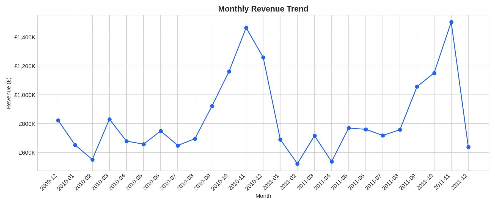
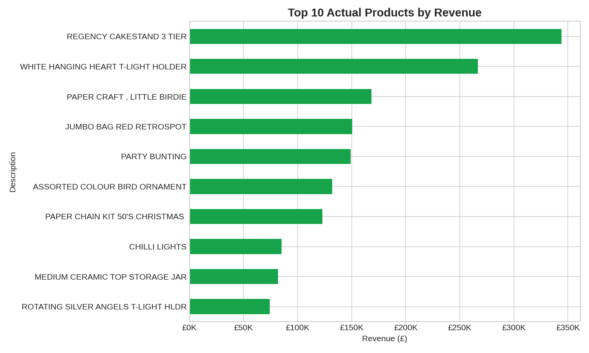
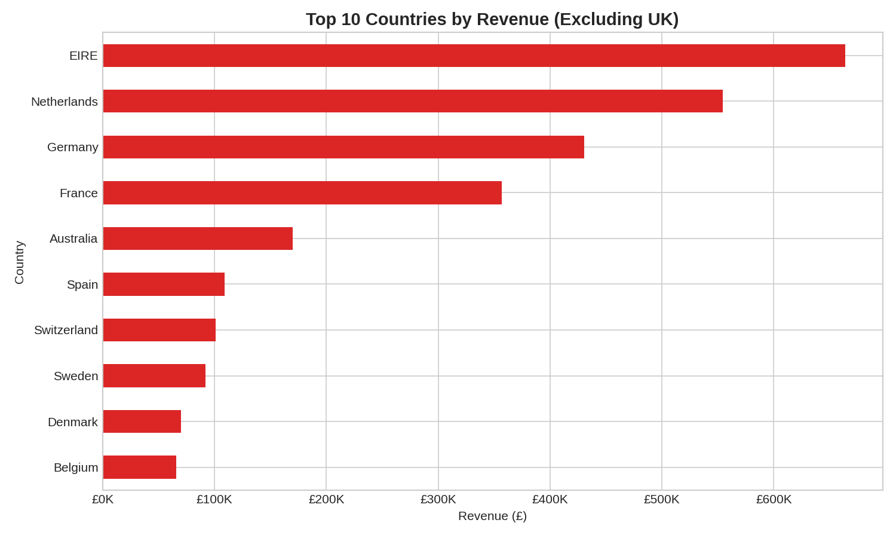
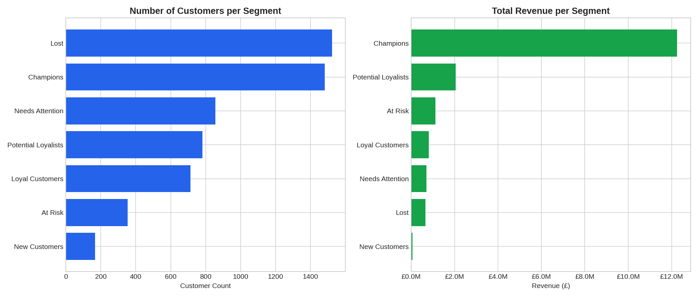
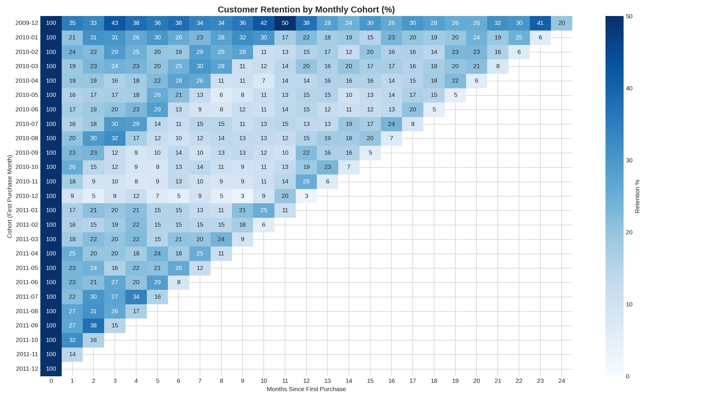
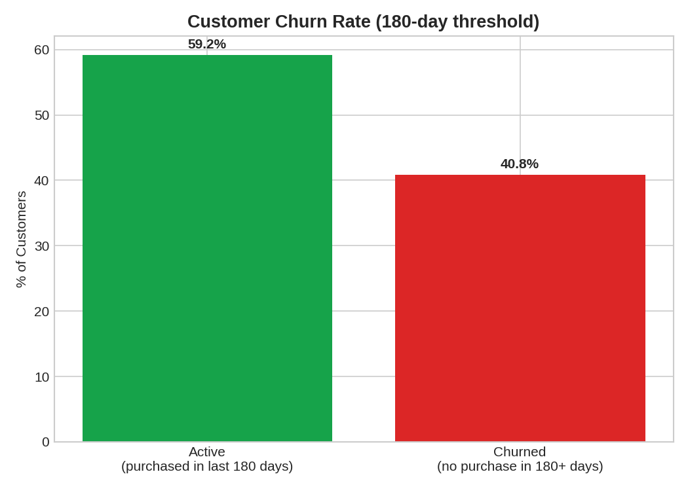
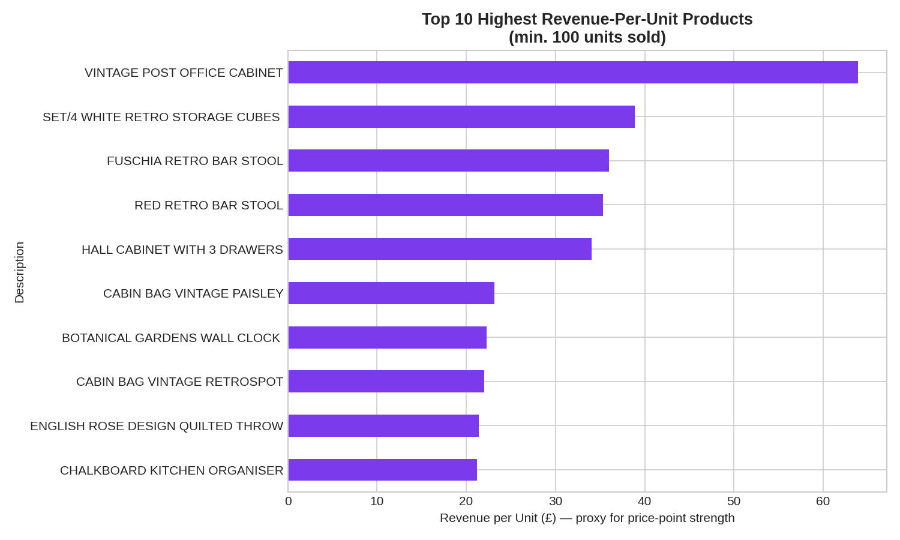
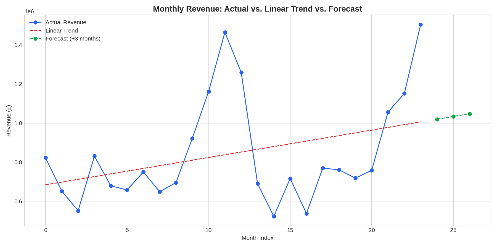

# E-Commerce Sales & Customer Analytics Dashboard

A full end-to-end data analytics project on two years of real e-commerce transaction data — from raw, messy data to cleaned dataset, exploratory analysis, customer segmentation, retention analysis, and a revenue forecast.

**Tools:** Python (pandas, matplotlib, seaborn, scikit-learn) in Google Colab
**Dataset:** [Online Retail II](https://archive.ics.uci.edu/dataset/502/online+retail+ii) — UCI Machine Learning Repository
**Scope:** Dec 2009 – Dec 2011 transactions from a UK-based online gift retailer

---

## Project overview

This project analyzes ~1 million transactions to answer real business questions:
- What are our sales trends, and which products/markets drive the most revenue?
- Which customers are most valuable, and which are at risk of churning?
- How does customer retention change over time?
- Can we forecast near-term revenue, and what are the limits of a simple model?
- What should the business actually do with these findings?

---

## Repository structure

```
├── README.md
├── 01_monthly_revenue_trend.png
├── 02_top_products_revenue_clean.png
├── 03_top_products_volume_clean.png
├── 04_top_countries_revenue.png
├── 05_top_countries_revenue_no_uk.png
├── 07_rfm_segments.png
├── 08_cohort_retention.png
├── 09_revenue_forecast.png
├── 10_product_efficiency.png
├── 11_churn_rate.png
├── notebook/
│   └── ecommerce_analytics.ipynb       # Full analysis notebook
└── Ecommerce_Analytics_Project_Report.pdf   # Full write-up (for interviews)
```

---

## 1. Data cleaning

Raw data: 1,067,371 rows across two sheets (2009-2010, 2010-2011). Issues found and fixed:

| Issue | Count | Action |
|---|---|---|
| Duplicate rows | 12,133 | Dropped |
| Cancelled orders (Invoice starts with "C") | 19,433 | Removed (refunds, not sales) |
| Invalid quantity/price (≤0) | 6,196 | Removed |
| Missing product descriptions | 4,382 | Filled via matching StockCode |
| Missing Customer ID | 243,007 (~23%) | Kept for sales analysis, excluded from customer segmentation |

**Result:** 1,029,609 clean transactions; 793,609 with a known customer (5,878 unique customers).

---

## 2. Sales performance



Revenue peaks every November ahead of the Christmas period, then drops into Q1. (The apparent Dec 2011 crash is a data artifact — the dataset only covers transactions through Dec 9th, not the full month.)



**REGENCY CAKESTAND 3 TIER** is the top revenue product (£344K). Non-product entries ("Manual", postage charges) were identified and excluded from this ranking to avoid misleading results.



The business is heavily UK-dependent. Among international markets, **EIRE (Ireland)** leads, followed by Netherlands and Germany.

---

## 3. Customer segmentation (RFM analysis)

Customers were scored on **Recency, Frequency, and Monetary** value (quintile-based scoring) and grouped into 7 segments.



| Segment | Customers | Revenue | % of Revenue |
|---|---|---|---|
| Champions | 1,482 | £12.26M | ~72% |
| Potential Loyalists | 782 | £2.05M | ~12% |
| At Risk | 353 | £1.12M | ~7% |
| Loyal Customers | 714 | £820K | ~5% |
| Needs Attention | 856 | £711K | ~4% |
| Lost | 1,523 | £664K | ~4% |
| New Customers | 168 | £56K | <1% |

**Key insight:** Just 25% of customers (Champions) generate ~72% of total revenue — a classic Pareto pattern, and the strongest single finding in this project.

Repeat purchase rate: **72.4%** of customers placed more than one order.

---

## 4. Cohort retention & churn



Most cohorts show a sharp drop-off immediately after their first purchase month, but customers who return for a second purchase tend to stay moderately active for a year or more.



Using a 180-day inactivity threshold: **40.8% of customers have churned**, 59.2% remain active.

---

## 5. Product efficiency (profitability proxy)

> **Note:** This dataset only includes selling price, not cost — so a true profit margin analysis isn't possible. Revenue-per-unit is used instead as the closest available proxy for product value.



Furniture/decor items (e.g. Vintage Post Office Cabinet) earn the most revenue per unit sold, distinct from the highest-*volume* sellers identified earlier.

---

## 6. Revenue forecasting



A simple linear regression forecasts ~£1.02M–£1.05M over the next 3 months. **R² = 0.127** — intentionally low, because a straight line can't capture the seasonality already identified in Section 2. A production model would need to explicitly account for seasonal patterns (e.g. SARIMA, Prophet).

---

## Business recommendations

1. **Scale inventory/staffing for November** ahead of the Christmas peak, especially for hero products.
2. **Launch a win-back campaign for "At Risk" customers** (353 people, £1.12M in past revenue, inactive ~11 months).
3. **Add a first-month follow-up incentive** — the steepest customer drop-off happens right after the first purchase.
4. **Prioritize EIRE, Netherlands, and Germany** for international growth efforts.
5. **Protect the "Champions" segment** with loyalty perks — they drive ~72% of revenue.
6. **Build a re-engagement email series** at 90/150 days of inactivity to intercept churn before it happens.

---

## Limitations & honest caveats

- No cost data → true profitability could not be calculated (revenue-per-unit used as proxy)
- December 2011 is a partial month (data ends Dec 9th) → excluded from forecasting
- Linear forecasting model doesn't capture seasonality → flagged explicitly rather than overstating accuracy

---

## Next steps

This project is Part 1 of a 3-project series:
- **Project 2:** SQL + Power BI dashboard (new dataset)
- **Project 3:** Full-stack analysis — SQL + Python + Power BI + Excel combined
